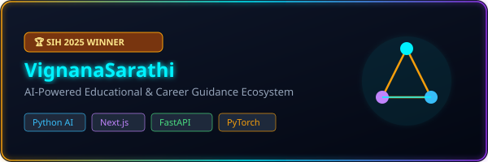
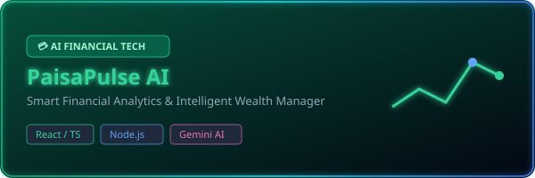
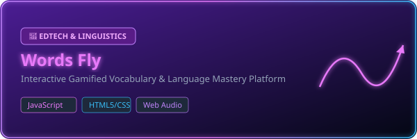
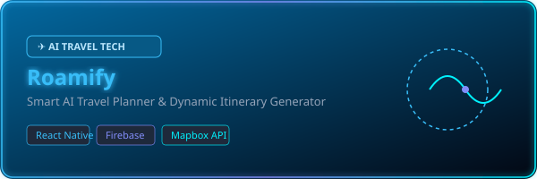
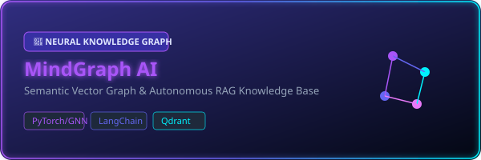

<a id="top"></a>

<!-- HERO BANNER SECTION -->
<div align="center">

  <!-- ANIMATED HERO BANNER SVG -->
  <a href="https://github.com/AnirudhPotukuchi">
    
  </a>

  <br/><br/>

  <!-- DYNAMIC TYPING SVG HEADER -->
  <a href="https://github.com/AnirudhPotukuchi">
    
  </a>

  <br/>

  <!-- QUICK QUICK STATUS PILLS & BADGES -->
  <p align="center">
    <a href="https://github.com/AnirudhPotukuchi">
      
    </a>
    <a href="https://github.com/AnirudhPotukuchi">
      
    </a>
    <a href="https://github.com/AnirudhPotukuchi">
      
    </a>
    <a href="https://github.com/AnirudhPotukuchi">
      
    </a>
  </p>

</div>


<!-- ABOUT ME SECTION -->
<div align="center">
  <h2> ⚡ ABOUT ME ⚡</h2>
</div>

<table width="100%" border="0" cellspacing="0" cellpadding="0">
  <tr>
    <td width="55%" valign="top">
      <div align="left">
        <h3>🚀 Futuristic AI Engineer &amp; Full Stack Architect</h3>
        <p>
          I'm <b>Anirudh Potukuchi</b>, a passionate <b>Computer Science Engineer</b> and the <b>National Winner of Smart India Hackathon (SIH) 2025 🏆</b>. I craft high-performance, intelligent applications at the intersection of <b>Generative AI, Large Language Models (LLMs), Deep Learning, and Cloud-Native Full Stack Web Technologies</b>.
        </p>
        <ul>
          <li>🎓 <b>Education:</b> B.Tech in Computer Science &amp; Engineering</li>
          <li>🏆 <b>Achievement:</b> Winner of <b>Smart India Hackathon 2025</b></li>
          <li>🤖 <b>AI Specialization:</b> RAG Systems, Multi-Agent Swarms, Fine-Tuning &amp; Neural Graphs</li>
          <li>⚡ <b>Full Stack Expertise:</b> Next.js 14/15, TypeScript, Python, FastAPI, Docker &amp; Cloud Infrastructure</li>
          <li>🌱 <b>Currently Learning:</b> Distributed Systems, PyTorch CUDA Kernels &amp; WebGPU</li>
          <li>💡 <b>Interests:</b> Autonomous AI Agents, High-Frequency Systems &amp; Algorithmic Coding</li>
          <li>📫 <b>Contact:</b> <a href="mailto:anirudh.potukuchi@example.com"><b>anirudh.potukuchi@gmail.com</b></a></li>
        </ul>
      </div>
    </td>
    <td width="45%" align="center" valign="middle">
      <br/>
      <!-- FUTURISTIC GLASSMORPHISM CARD STATS -->
      <table background="#090D16" style="border: 2px solid #00F2FE; border-radius: 12px; padding: 15px;">
        <tr>
          <td align="center">
            
            <h4 style="color: #00F2FE; margin: 5px 0;">CYBERPUNK DEV MATRIX</h4>
            <p font-size="12px" color="#94A3B8">
              <b>Code Quality:</b> Production-Grade ⚡<br/>
              <b>Architecture:</b> Microservices &amp; Serverless ☁️<br/>
              <b>Problem Solving:</b> 1000+ Algorithmic Challenges 🧩<br/>
              <b>Hackathon Record:</b> SIH 2025 National Winner 🥇
            </p>
          </td>
        </tr>
      </table>
    </td>
  </tr>
</table>

<br/>


<!-- ANIMATED TECH STACK SECTION -->
<div align="center">
  <h2> 🛠️ TECH STACK &amp; CYBERNETIC ECOSYSTEM 🛠️</h2>
  <p><i>Powers &amp; Technologies I Leverage to Build Next-Gen Intelligence</i></p>
</div>

<br/>

<div align="center">

  <!-- PROGRAMMING LANGUAGES -->
  <h3>⚡ Programming Languages</h3>
  <p>
    
    
    
    
    
    
    
    
    
  </p>

  <!-- AI & MACHINE LEARNING -->
  <h3>🤖 AI, Machine Learning &amp; LLMs</h3>
  <p>
    
    
    
    
    
    
    
    
    
  </p>

  <!-- FRONTEND DEVELOPMENT -->
  <h3>🎨 Frontend Architecture</h3>
  <p>
    
    
    
    
    
    
  </p>

  <!-- BACKEND & APIs -->
  <h3>⚙️ Backend &amp; Microservices</h3>
  <p>
    
    
    
    
    
    
    
  </p>

  <!-- DATABASES & VECTOR DBs -->
  <h3>🗄️ Databases &amp; Vector Search</h3>
  <p>
    
    
    
    
    
    
    
  </p>

  <!-- CLOUD & DEVOPS -->
  <h3>☁️ Cloud Infrastructure &amp; DevOps</h3>
  <p>
    
    
    
    
    
    
    
  </p>

  <!-- TOOLS & WORKFLOW -->
  <h3>🛠️ Developer Tools</h3>
  <p>
    
    
    
    
    
  </p>

</div>

<br/>


<!-- GITHUB STATISTICS & METRICS -->
<div align="center">
  <h2> 📊 GITHUB METRICS &amp; TELEMETRY 📊</h2>
  <p><i>Live Insights &amp; Coding Telemetry</i></p>
</div>

<br/>

<div align="center">
  
  <!-- READSTATES CARDS GRID -->
  <table border="0">
    <tr>
      <td width="50%" align="center">
        <a href="https://github.com/AnirudhPotukuchi">
          
        </a>
      </td>
      <td width="50%" align="center">
        <a href="https://github.com/AnirudhPotukuchi">
          
        </a>
      </td>
    </tr>
    <tr>
      <td width="50%" align="center">
        <a href="https://github.com/AnirudhPotukuchi">
          
        </a>
      </td>
      <td width="50%" align="center">
        <a href="https://github.com/AnirudhPotukuchi">
          
        </a>
      </td>
    </tr>
  </table>

  <br/>

  <!-- GITHUB TROPHIES MATRIX -->
  <h3>🏆 GitHub Cyber Trophies</h3>
  <a href="https://github.com/AnirudhPotukuchi">
    
  </a>

  <br/><br/>

  <!-- CONTRIBUTION SNAKE ANIMATION -->
  <h3>🐍 Contribution Snake Graph</h3>
  <p align="center">
    
  </p>

</div>

<br/>


<!-- FEATURED PROJECTS SHOWCASE -->
<div align="center">
  <h2> 🚀 FEATURED PROJECTS &amp; INNOVATIONS 🚀</h2>
  <p><i>Selected Flagship Creations &amp; Award-Winning Solutions</i></p>
</div>

<br/>

<!-- PROJECT 1: VIGNANASARATHI -->
<table width="100%" border="0" cellspacing="0" cellpadding="0">
  <tr>
    <td width="100%">
      <a href="https://github.com/AnirudhPotukuchi/VignanaSarathi">
        
      </a>
      <p align="right">
        <a href="https://github.com/AnirudhPotukuchi/VignanaSarathi">
          
        </a>
        <a href="https://github.com/AnirudhPotukuchi/VignanaSarathi">
          
        </a>
        <a href="https://vignanasarathi-demo.vercel.app">
          
        </a>
      </p>
    </td>
  </tr>
</table>

<br/>

<!-- PROJECT 2: PAISAPULSE AI -->
<table width="100%" border="0" cellspacing="0" cellpadding="0">
  <tr>
    <td width="100%">
      <a href="https://github.com/AnirudhPotukuchi/PaisaPulse-AI">
        
      </a>
      <p align="right">
        <a href="https://github.com/AnirudhPotukuchi/PaisaPulse-AI">
          
        </a>
        <a href="https://github.com/AnirudhPotukuchi/PaisaPulse-AI">
          
        </a>
        <a href="https://paisapulse-ai.vercel.app">
          
        </a>
      </p>
    </td>
  </tr>
</table>

<br/>

<!-- PROJECT 3: WORDS FLY -->
<table width="100%" border="0" cellspacing="0" cellpadding="0">
  <tr>
    <td width="100%">
      <a href="https://github.com/AnirudhPotukuchi/Words-Fly">
        
      </a>
      <p align="right">
        <a href="https://github.com/AnirudhPotukuchi/Words-Fly">
          
        </a>
        <a href="https://github.com/AnirudhPotukuchi/Words-Fly">
          
        </a>
        <a href="https://wordsfly.vercel.app">
          
        </a>
      </p>
    </td>
  </tr>
</table>

<br/>

<!-- PROJECT 4: ROAMIFY -->
<table width="100%" border="0" cellspacing="0" cellpadding="0">
  <tr>
    <td width="100%">
      <a href="https://github.com/AnirudhPotukuchi/Roamify">
        
      </a>
      <p align="right">
        <a href="https://github.com/AnirudhPotukuchi/Roamify">
          
        </a>
        <a href="https://github.com/AnirudhPotukuchi/Roamify">
          
        </a>
        <a href="https://roamify-ai.vercel.app">
          
        </a>
      </p>
    </td>
  </tr>
</table>

<br/>

<!-- PROJECT 5: MINDGRAPH AI -->
<table width="100%" border="0" cellspacing="0" cellpadding="0">
  <tr>
    <td width="100%">
      <a href="https://github.com/AnirudhPotukuchi/MindGraph-AI">
        
      </a>
      <p align="right">
        <a href="https://github.com/AnirudhPotukuchi/MindGraph-AI">
          
        </a>
        <a href="https://github.com/AnirudhPotukuchi/MindGraph-AI">
          
        </a>
        <a href="https://mindgraph-ai.vercel.app">
          
        </a>
      </p>
    </td>
  </tr>
</table>

<br/>


<!-- TIMELINE SECTION -->
<div align="center">
  <h2> ⏳ CYBERNETIC TIMELINE &amp; JOURNEY ⏳</h2>
  <p><i>Milestones Across Academia, Engineering &amp; National Honors</i></p>
</div>

<br/>

<div align="center">

```gantt
timeline
    title Anirudh Potukuchi's Developer Journey
    section Foundations
        High Schooling : STEM Excellence & Basic Coding
        CSE Undergraduate : Data Structures, Algorithms & Web Stack
    section Milestones
        Hackathons & Projects : Built Full-Stack Apps & AI Experiments
        SIH 2025 Victory : 🏆 Smart India Hackathon 2025 National Winner
    section Professional
        Software & AI Internships : Enterprise AI RAG Systems & Next.js
        Open Source Leadership : Multi-Agent AI Frameworks
    section Frontier
        Future Horizons : Autonomous AI Agents & High Scale Distributed Systems
```

</div>

<br/>


<!-- ACHIEVEMENTS SECTION -->
<div align="center">
  <h2> 🏆 HONORS &amp; ACHIEVEMENTS 🏆</h2>
</div>

<br/>

<table width="100%" border="0" cellspacing="10" cellpadding="10">
  <tr>
    <td width="33%" align="center" style="border: 1px solid #F59E0B; border-radius: 10px; background-color: #0B0F19;">
      
      <h3 style="color: #F59E0B;">SIH 2025 Winner</h3>
      <p style="color: #94A3B8; font-size: 13px;">
        Secured <b>1st Rank Nationally</b> in Smart India Hackathon 2025 among thousands of participating teams across India.
      </p>
    </td>
    <td width="33%" align="center" style="border: 1px solid #00F2FE; border-radius: 10px; background-color: #0B0F19;">
      
      <h3 style="color: #00F2FE;">Hackathon Champion</h3>
      <p style="color: #94A3B8; font-size: 13px;">
        Winner &amp; finalist in multiple national level hackathons building AI, Web3 &amp; Impactful Tech Solutions.
      </p>
    </td>
    <td width="33%" align="center" style="border: 1px solid #C084FC; border-radius: 10px; background-color: #0B0F19;">
      
      <h3 style="color: #C084FC;">1000+ Problems</h3>
      <p style="color: #94A3B8; font-size: 13px;">
        Solved over 1,000 algorithmic &amp; data structure challenges across LeetCode, Codeforces &amp; CodeChef.
      </p>
    </td>
  </tr>
</table>

<br/>


<!-- CODING PROFILES & SOCIAL MATRIX -->
<div align="center">
  <h2> 🌐 CONNECT &amp; CODING PROFILES 🌐</h2>
  <p><i>Let's Build The Future Together</i></p>
</div>

<br/>

<div align="center">

  <a href="https://github.com/AnirudhPotukuchi">
    
  </a>
  <a href="https://linkedin.com/in/anirudhpotukuchi">
    
  </a>
  <a href="https://leetcode.com/AnirudhPotukuchi">
    
  </a>
  <a href="https://codeforces.com/profile/AnirudhPotukuchi">
    
  </a>
  <a href="https://codechef.com/users/anirudh_pot">
    
  </a>
  <br/><br/>
  <a href="https://hackerrank.com/anirudhpotukuchi">
    
  </a>
  <a href="https://geeksforgeeks.org/user/anirudhpotukuchi">
    
  </a>
  <a href="https://anirudhpotukuchi.dev">
    
  </a>
  <a href="mailto:anirudh.potukuchi@gmail.com">
    
  </a>

</div>

<br/>


<!-- VISITOR COUNTER & DYNAMIC BADGES -->
<div align="center">
  <h2> 👁️ VISITOR TELEMETRY 👁️</h2>
</div>

<br/>

<div align="center">
  <p>
    <a href="https://github.com/AnirudhPotukuchi">
      
    </a>
    <a href="https://github.com/AnirudhPotukuchi?tab=followers">
      
    </a>
    <a href="https://github.com/AnirudhPotukuchi?tab=repositories">
      
    </a>
  </p>
</div>

<br/>


<!-- DEV FUN & UTILITIES -->
<div align="center">
  <h2> 🎮 DEV FUN &amp; HUMOR 🎮</h2>
</div>

<br/>

<table width="100%" border="0">
  <tr>
    <td width="50%" align="center" valign="top">
      <h4>💡 Daily Developer Inspiration</h4>
      <a href="https://github.com/AnirudhPotukuchi">
        
      </a>
    </td>
    <td width="50%" align="center" valign="top">
      <h4>☕ Support &amp; Energy</h4>
      <p align="center">
        <a href="https://www.buymeacoffee.com/anirudh">
          
        </a>
      </p>
      <br/>
      
    </td>
  </tr>
</table>

<br/>


<!-- FOOTER SECTION -->
<div align="center">

  

  <br/><br/>

  <h3>✨ Thank You For Visiting! Let's Build Something Extraordinary. ✨</h3>
  <p><i>"The best way to predict the future is to invent it." — Alan Kay</i></p>

  <br/>

  <!-- BACK TO TOP BUTTON -->
  <a href="#top">
    
  </a>

  <br/><br/>

  <p>
    <sub>Designed with ❤️ and Cyberpunk Aesthetics for <b>Anirudh Potukuchi</b> • © 2026</sub>
  </p>

</div>
